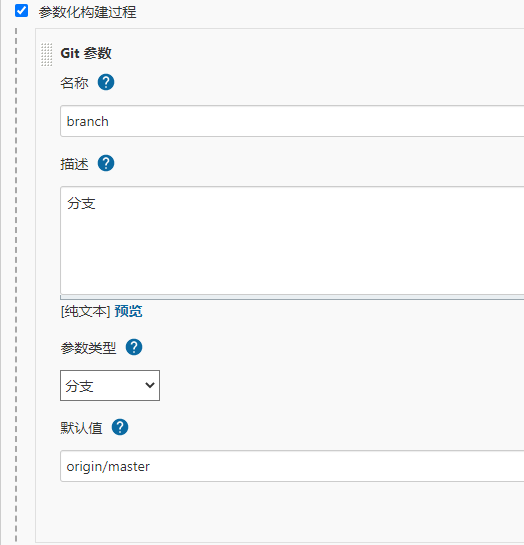
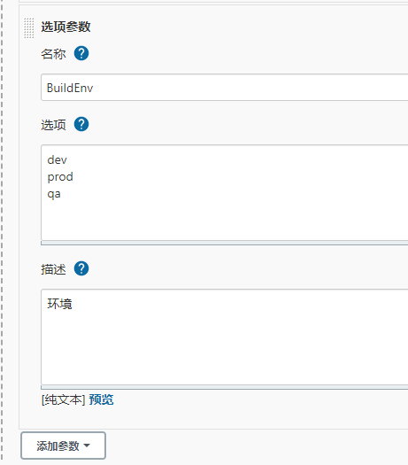
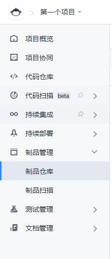

# Git+Jenkins+Docker+Rancher敏捷开发环境搭建

## 目的

我们本地写完的Java代码想要在服务器运行, 就要在开发环境写完, 然后给生产环境部署相应的JRE,
将代码打成Jar包利用ftp等工具部署在服务器上. 这样的操作其实很消耗时间, Idea有一个自动部署的功能,
可以将未编译代码直接同步到服务器, 但也不是最好的效果.

随着这几年容器技术的发展, 以Docker为首, 各种云原生框架层出不穷, 例如大名鼎鼎的k8s.

他们是怎么做的呢? 

Docker技术我就不普及了, 这项技术最大的特点就是, 解耦合(隔离). 例如我在A服务器上希望部署2个微服务,
其中一个要运行在java8, 另一个要运行在java11, 这时候系统的管理就会略显混乱. 当我们微服务模块足够多的时候,
就会发生不可预知的错误, 所以我们更偏向把应用打包成**Docker镜像**, 通过服务器部署Docker镜像的方式部署应用.

打包发布Docker镜像需要用到`docker build`和`docker push`命令, 我们每次进行代码编写后还要多运行两个命令, 
显然解决了上述所说的版本问题, 但是好像更加复杂了, 那我们怎么办呢? 使用Jenkins.

Jenkins可以帮助你自动构建代码, 编译代码, 通过Maven插件可以做到自动打包发布Docker镜像到我们的镜像hub里.

现在镜像有了, 我们要使用`docker pull`命令拉取镜像并运行, 但也太麻烦了, 而且负载均衡不好做, ip不好管理.
这个时候就是k8s的作用, 我们利用rancher自动拉取最新镜像并部署.

## 准备

1. Linux服务器, 我准备的是山寨云8核8G的Centos7服务器
2. Jenkins客户端
3. Rancher客户端
4. 属于自己的Git平台, 我用的是国内的Coding

## 流程

### 安装Jenkins

[官方连接](https://pkg.jenkins.io/redhat/)

由于整个安装过程没什么疑问, 我这里相当于是官方连接的翻译.

#### 1. 获取Repository和秘钥

```shell
sudo wget -O /etc/yum.repos.d/jenkins.repo https://pkg.jenkins.io/redhat/jenkins.repo
sudo rpm --import https://pkg.jenkins.io/redhat/jenkins.io.key
```

#### 2. 安装Jenkins

```shell
yum install jenkins
```

#### 3. 启动

```shell
systemctl start jenkins
```

通过`systemctl`命令管理jenkins启动状态.

#### 4. 补充

可能会涉及到没有daemonize, 就整一下这个命令
```shell
yum install epel-release # repository that provides 'daemonize'
```

也有利用Tomcat启动Jenkins的, 也可以.

官方也有docker启动, 没试过:[官方连接](https://www.jenkins.io/zh/doc/book/installing/)
```shell
docker run \
  -u root \
  --rm \  
  -d \ 
  -p 8080:8080 \ 
  -p 50000:50000 \ 
  -v jenkins-data:/var/jenkins_home \ 
  -v /var/run/docker.sock:/var/run/docker.sock \ 
  jenkinsci/blueocean 
```

#### 5. 设置权限

后期会遇到如下问题:
1. 读取maven的setting.xml
2. 将dependency写入local repository
3. 获取git ssh key

这些都需要权限, 我们直接给jenkins整成root的
```shell
vi /etc/sysconfig/jenkins
```
找到`JENKINS_USER="xxx"`, 修改为`JENKINS_USER="root"`, 然后systemctl重启jenkins.


### 安装docker

[官方文档](https://docs.docker.com/engine/install/centos/)

也是整个过程毫无疑问, 直接作为翻译

#### 1. 清除已安装的docker相关内容

```shell
yum remove docker \
    docker-client \
    docker-client-latest \
    docker-common \
    docker-latest \
    docker-latest-logrotate \
    docker-logrotate \
    docker-engine
```

#### 2. 添加repository

```shell
yum install -y yum-utils
yum-config-manager \
    --add-repo \
    https://download.docker.com/linux/centos/docker-ce.repo
```

#### 3. 安装

```shell
yum install docker-ce docker-ce-cli containerd.io
```

当然, 可以自己选择版本, 去官网看去吧.

#### 4. 启动

```shell
systemctl start docker
```
同样是通过systemctl命令管理docker启动状态, 不多赘述


### 安装Rancher

有了docker之后, 安装rancher就简单的多了, 我选择rancher1.x.

```shell
docker run -d --restart=unless-stopped -p 8080:8080 rancher/server:stable
```

没什么好说的, docker启动就这么简单

### 配置Jenkins

这一步比较复杂, 我们需要将Jenkins进行很多配置.

#### Java11

第一种方法就是通过yum直接下载openjdk11, 网上一搜一大把.

主要阐述第二种方法. 我自身服务器运行的是Java8, 我怕卸载不彻底, 我选择不卸载, 我直接共存一个jdk11.

1. [清华源](https://mirror.tuna.tsinghua.edu.cn/AdoptOpenJDK/11/jdk/x64/linux/)

    当然, 根据自己系统情况选择合适版本, 别盲目就和我一样了
   
2. 解压`tar -zxvf xxx.tar.gz`

3. 打开你的jenkins-系统管理-全局工具配置, 把你的jdk目录整进去

#### Maven

直接`yum install maven`

安装好后在/usr/share/maven, 一样的在上面那个配置里配置进去

#### Maven Setting

第一个方法, 这个地方可以选择自动生成的也可以选择自己的, 推荐自己整一个, 需要权限, 如果不想放开权限可以`chown jenkins`

第二个方法, 通过jenkins的一个插件, 叫做Config File Provider Plugin, 具体应用这个插件的方法, 请参考[文章](https://blog.csdn.net/weixin_30500663/article/details/99071287)

#### Git

服务器安装好git之后就行, 不需要配置

但是要把生成的公钥放到你的git平台, 并且把公钥内容拷贝到jenkins文件夹下面.

就是把.ssh整到这里来一份`/var/lib/jenkins/`

变成`/var/lib/jenkins/.ssh/**`

#### Git Parameter Plug-In

推荐下载这个, 下载之后, 每次构建就可以选择需要构建的分支. 具体配置很简单, 勾选就行.




#### 参数化构建

下载Extended Choice Parameter Plug-In插件, 可以在构建时选择参数(配置文件).



这里选择完, 在后面的maven命令里要带上这个参数, 不然等于没选

#### 插件

当然啊, 这中间过程还会让你下载各种插件, 下就行了, jenkins插件市场很干净, 没有鱼龙混杂.


### 配置Coding

#### 配置docker镜像仓库

打开[Coding](https://coding.net/)

注册, 登录, 创建团队, 创建项目.

然后创建完就会看到



这个有个制品仓库, 创建一个, 我的叫dev.

> 这里有个小问题, 我的仓库只要是私有的就无法访问, 如果有能解决的希望你能不吝啬你的方案

跟着里面的操作指引, 给自己Jenkins所在的服务器添加权限.

可以试着自己push或者pull一个, 我这里push了OpenJdk11的镜像(以后用得上)

#### 创建git仓库

这个不用我多说, 自己创建好, 然后随便push一个SpringBoot项目以便测试部署情况.

### 配置Rancher

安装好rancher之后, 首先添加主机节点, 我只有一个服务器, 我也没别的可选的, 如果你们有多个,
可以配置很多主从机

添加服务 - 添加容器就大功告成了

这里注意一个问题, 就是一定要记得端口的映射.

#### 端口失效问题

我遇到了, 就是我的端口也没有防火墙, 访问什么都是可以的, 但是唯独rancher的无法访问.

解决思路:
1. 首先我在本地部署了这个镜像, 发现本地部署的可以运行.
2. 查看`docker ps`, 发现rancher启动的镜像没有端口映射
3. 向前辈请教后知道, rancher的端口都是走iptables的, 没走docker
4. 我好像也没有iptables, systemctl了一下也不成功, 无解了吗
5. 我尝试安装了一下iptables, 又卸载, 噢, 解决了.

## pom.xml

具体pom.xml怎么弄看项目吧, 大部分内容直接copy就行.
至此, 一个Maven敏捷开发环境搭建成功!